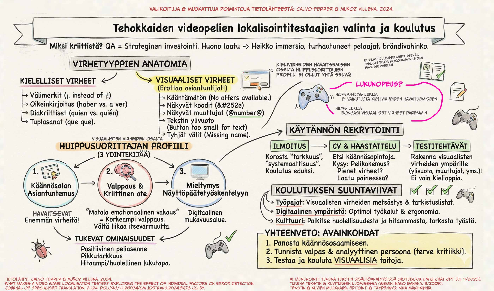
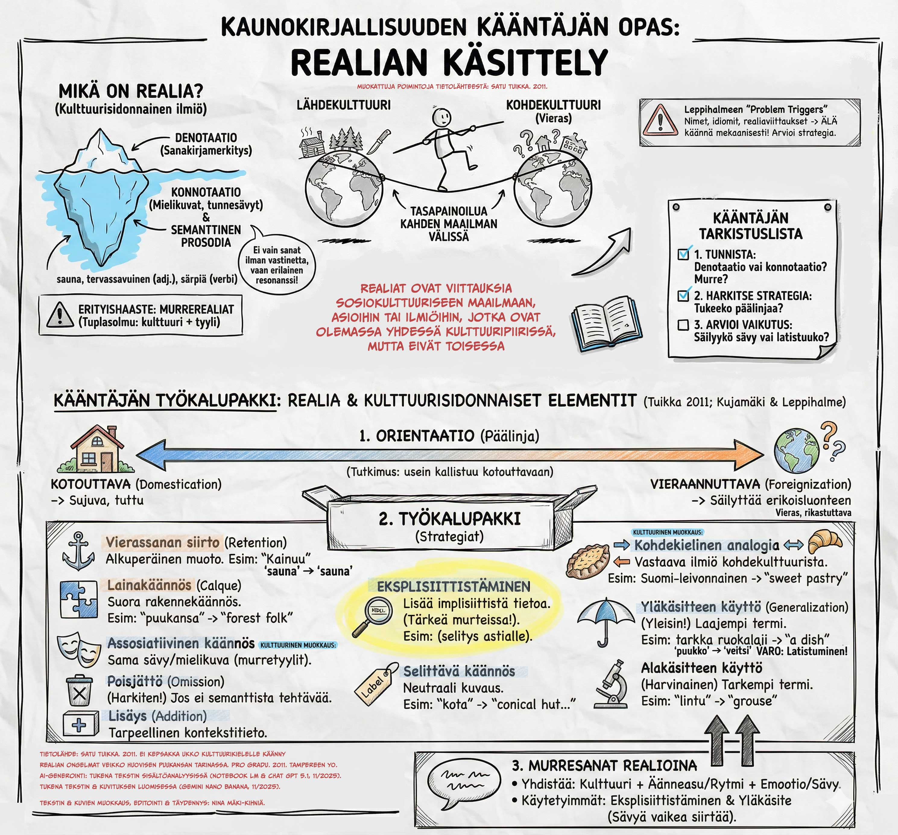
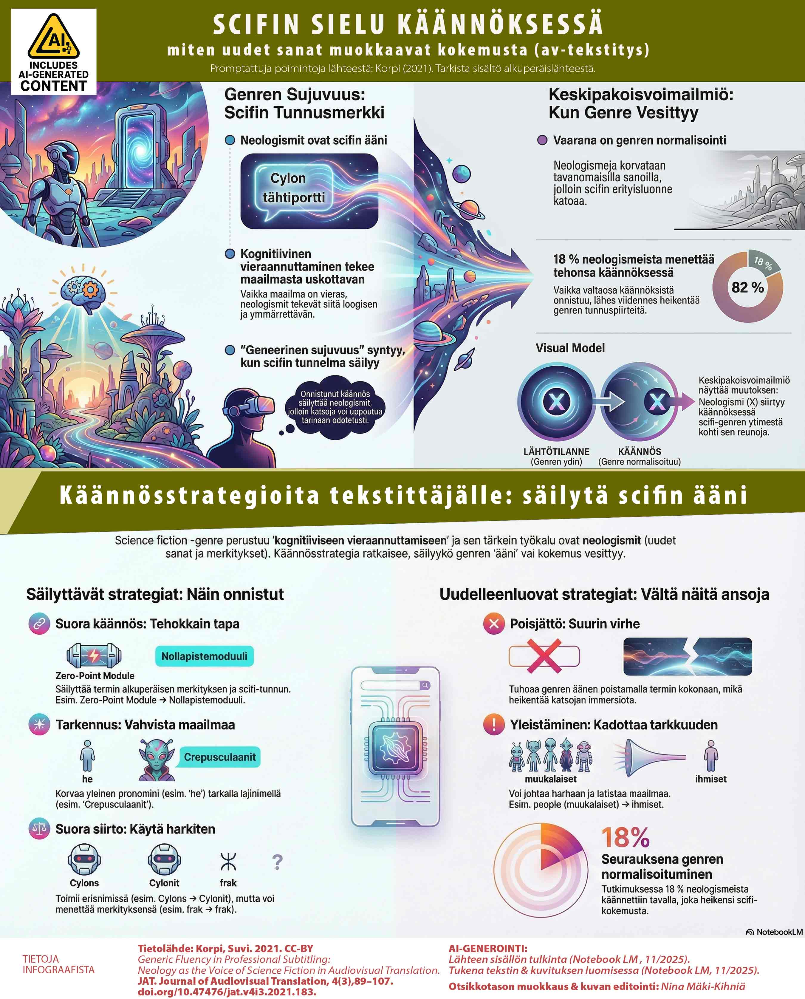

# ScienceGraphics 🎬

<table><tr><td>

## Kieliammattilainen videopelien lokalisoinnin testaajana? 

Poimintoja tietolähteestä: Calvo-Ferrer & Muñoz Villena. 2024. CC-BY.
What makes a video game localisation tester? Exploring the effect of individual factors on error detection. 
Journal of Specialised Translation. 2024. doi.org/10.26034/cm.jostrans.2024.5978 

</td></tr></table>

</td></tr></table>

## Sitä vain ei voi kääntää? 

Poimintoja tietolähteestä: Tuikka 2021. Pro gradu. Tampereen yo. Ei kaupalliseen.
Ei kepsakka ukko kulttuurikielelle käänny
Realian ongelmat Veikko Huovisen Puukansan tarinassa.

</td></tr></table>

<table><tr><td>

## Scifi-maailman sanojen kääntämisestä 

Poimintoja tietolähteestä: Korpi, Suvi. 2021. CC-BY
Generic Fluency in Professional Subtitling: 
Neology as the Voice of Science Fiction in Audiovisual Translation. 
JAT. Journal of Audiovisual Translation, 4(3),89–107. doi.org/10.47476/jat.v4i3.2021.183.

</td></tr></table>
